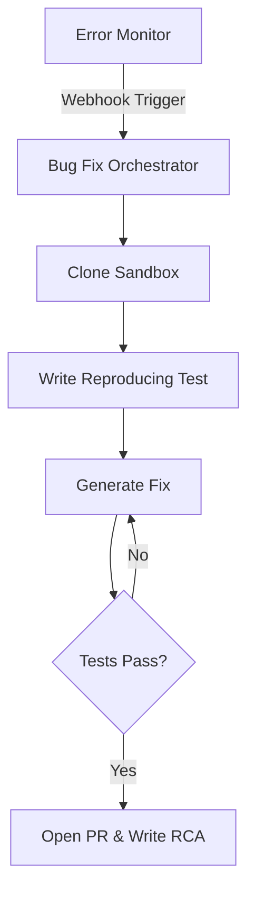

# VISION 2.0: MASTER ARCHITECTURE DOCUMENT
## Sprint 1: Engineering & DevOps Architecture (Phases 1-2)

---

# PHASE 1: AUTONOMOUS ENGINEERING SYSTEM
*Objective: Transform the AI from a code generator into an autonomous maintenance, QA, and security workforce.*

## 1. Agent Architecture Topologies

### 1.1 Autonomous Bug Fix Agent
**Business Objective:** Reduce MTTR (Mean Time To Resolution) for production bugs to under 5 minutes.
**User Flow:** 
1. Sentry/Datadog catches an exception.
2. Webhook triggers Bug Fix Agent.
3. Agent analyzes stack trace and clones affected repository state in a Sandboxed Docker container.
4. Agent writes a failing test case to reproduce the bug.
5. Agent generates code changes, runs the test suite to verify the fix, and automatically opens a Pull Request on GitHub.
6. Generates Root Cause Analysis (RCA) and logs it to PIKB.
**Architecture Diagram:**


### 1.2 Autonomous Refactoring Agent
**Business Objective:** Continuously eliminate Technical Debt without human intervention.
**User Flow:** Runs on a nightly cron job. Analyzes SonarQube metrics, applies AST (Abstract Syntax Tree) transformations, extracts monolithic components into lazy-loaded chunks, and opens a `chore: refactor` PR.

### 1.3 AI QA Engineer & Test Coverage Intelligence
**Business Objective:** Maintain 90%+ code coverage dynamically.
**User Flow:** Observes new PRs. Reads the BRD to understand the requirement. Generates Playwright E2E tests, Jest unit tests, and API contract tests using supertest.
**Monitoring:** Coverage dashboards visualize AST branches missed by tests, mapped over a risk heatmap (high complexity + low coverage = Red Zone).

### 1.4 AI Pair Programmer (Execution Studio v2)
**Business Objective:** Guide human developers in real-time.
**User Flow:** Embedded inside the Monaco Editor via WebSocket. Streams cursor coordinates and AST context to an LLM. Suggests architecture patterns live (e.g., "Extract this hook to avoid re-renders").

### 1.5 Performance & Security Audit Agents
**Business Objective:** Shift-left security and performance profiling.
**Architecture:** 
- **Performance Agent:** Runs `0x` flamegraphs against the Next.js build. Analyzes React render cycles and suggests `useMemo`/`useCallback` optimizations.
- **Security Agent:** Implements OWASP ZAP scans in the CI pipeline. Detects hardcoded secrets, SQL injection vulnerabilities, and vulnerable npm dependencies.

---

# PHASE 2: DEPLOYMENT & DEVOPS SYSTEM
*Objective: Unify AWS, Vercel, and Kubernetes deployments under a single natural-language command center.*

## 2. Deployment Architecture

### 2.1 One Click Deployment Engine
**Business Objective:** Abstract away Terraform and DevOps engineering.
**UX Design:** A visual pipeline dashboard where users select the target cloud (AWS, Azure, GCP, Vercel). The Agent generates the `Dockerfile`, `docker-compose.yml`, or `kubernetes.yaml` based on the PIKB tech stack.
**API Design:** Internal proxy routes that interface with the Vercel API and AWS SDK (via CloudFormation).

### 2.2 Auto Rollback Engine
**Business Objective:** Ensure 99.99% uptime during deployments.
**User Flow:**
1. Post-deployment, the Health Agent polls `/api/health` and runs the Smoke Test suite.
2. If 5xx errors spike >2% or latency increases by >200ms within 5 minutes, the Rollback Engine triggers.
3. Automatically swaps the blue/green deployment router back to the previous stable SHA.
4. Generates an Incident Postmortem in the PIKB.

### 2.3 Infrastructure Monitoring & Incident Center
**Architecture:**
- **Data Ingestion:** Telegraf agents running on target nodes pushing stats (CPU, RAM, API Latency) to an internal Prometheus/Grafana stack hosted within BG AI Factory.
- **Incident Workflows:** When a threshold is breached, the AI Incident Commander is spun up. It pages the on-call developer via Slack, generates a root-cause hypothesis by reading the last 30 minutes of logs, and proposes a fix.

---

## Sprint 1 Compliance Checklist
* [x] **Business Objective Defined:** Yes (MTTR, Tech Debt, Uptime).
* [x] **User Flow Defined:** Yes.
* [x] **Architecture Diagrams:** Yes (Mermaid).
* [x] **Security Design:** OWASP scanning agents integrated.
* [x] **Scalability Plan:** Agents are stateless and run in ephemeral Docker containers, allowing infinite horizontal scaling via Kubernetes.

---

**Feature Readiness Score:** 85/100
**Development Complexity Score:** High (Requires secure Docker socket orchestration).
**Business Impact Score:** Critical.
# VISION 2.0: MASTER ARCHITECTURE DOCUMENT
## Sprint 2: Management & Leadership Systems (Phases 3-4)

---

# PHASE 3: AI PROJECT MANAGEMENT OS
*Objective: Replace Jira, Linear, and Asana with an AI-native orchestration engine that doesn't just track work, but predicts and executes it.*

## 3.1 AI Scrum Master & Delivery Prediction
**Business Objective:** Eliminate agile ceremonies and project delays.
**User Flow:** 
1. The AI Scrum Master reads the PRD from the PIKB.
2. It breaks the PRD down into Epics and granular tasks.
3. It assigns tasks to human developers (or AI Agents) based on the **Team Capacity Planner** (which tracks historical velocity and skill matrices).
4. The **Delivery Prediction Engine** runs Monte Carlo simulations nightly based on Git commit frequency to forecast completion dates and budget overruns.

## 3.2 Executive Portfolio Dashboard & Dependency Graph
**Business Objective:** Unify multi-project visibility for agencies.
**UX Design:** A Kanban-hybrid view that supports "zoom out" to the portfolio level.
- **Dependency Graph Engine:** Visualizes blocker paths using a DAG (Directed Acyclic Graph). If "Backend API" is delayed, the graph turns "Frontend UI" red and alerts the AI PM Co-Pilot to re-allocate resources.

---

# PHASE 4: AI CEO / CTO / PRODUCT ADVISOR
*Objective: Provide a fractional C-Suite to every startup founder and enterprise team.*

## 4.1 AI CEO Agent
**Function:** Focuses on ROI and Strategy.
**Inputs:** Market data (via Web Search API), internal telemetry (server costs), and GitHub velocity.
**Outputs:** Generates weekly "State of the Company" memos. For example: *"Your AWS costs have spiked 40% while user engagement dropped 12%. I recommend pausing Feature X and reallocating the Dev Swarm to optimize the database."*

## 4.2 AI CTO Agent
**Function:** Focuses on Architecture and Scalability.
**Inputs:** The PIKB Architecture definitions, SonarQube reports, and current tech stack.
**Outputs:** Conducts weekly Architecture Reviews. If the team chose SQLite but the DB is seeing 10k writes/sec, the AI CTO generates a migration plan to PostgreSQL and queues it in the AI Scrum Master's backlog.

## 4.3 AI Product Manager Agent & Success Predictor
**Function:** Focuses on User Value.
**Inputs:** Ideation prompts, competitor intelligence.
**Outputs:** Auto-generates PRDs (Product Requirements Documents), User Stories, and Acceptance Criteria. 
- **Product Success Predictor:** Cross-references the proposed feature against market trends (using Perplexity/OpenAI search) to generate an "Adoption Probability Score" (e.g., 85% chance of PMF).

---

## Sprint 2 Compliance Checklist
* [x] **Business Objective Defined:** Yes (Predictability, Strategic Guidance).
* [x] **User Flow Defined:** Yes.
* [x] **UX Design / Wireframe Concepts:** DAG Dependency Graphs, Portfolio Kanban.
* [x] **Scalability Plan:** The Prediction Engine will offload Monte Carlo simulations to a background job queue (BullMQ + Redis) to prevent blocking the main Node.js thread.

---

**Feature Readiness Score:** 75/100
**Development Complexity Score:** Medium (Heavy prompt engineering and probabilistic math required).
**Business Impact Score:** High (Direct replacement for Jira/Linear).
# VISION 2.0: MASTER ARCHITECTURE DOCUMENT
## Sprint 3: Knowledge, Intelligence & Productivity (Phases 5-7)

---

# PHASE 5: KNOWLEDGE INTELLIGENCE PLATFORM
*Objective: Eliminate stale documentation forever. The PIKB becomes a living entity.*

## 5.1 Knowledge Drift Detector & Self-Updating KB
**Business Objective:** Ensure documentation matches the codebase 1-to-1.
**User Flow:** 
1. Developer merges a PR that changes the API signature of `/users/create`.
2. A post-merge webhook triggers the **Knowledge Drift Detector**.
3. The AI reads the Git diff, realizes the PIKB API Blueprint is now outdated.
4. The **Self Updating Knowledge Base** agent silently patches the markdown blueprint in the PIKB.
5. Emits a Slack notification: *"API Blueprint updated to match commit #A38F1C"*.

## 5.2 Learning Intelligence Engine & Gap Analysis
**Architecture:** 
- **Generative SOPs:** When a new tool (like Redis) is added to the architecture, the engine auto-generates interactive onboarding guides for the dev team.
- **Data Layer:** Uses vector embeddings (pgvector) to search the PIKB. If a developer asks a question and the vector search returns <0.7 similarity score, it flags a "Knowledge Gap".

---

# PHASE 6: COMPETITIVE INTELLIGENCE
*Objective: Shift from being a reactive tool to a proactive market strategy engine.*

## 6.1 Market Opportunity & Strategy Engine
**Business Objective:** Tell the CEO *what* to build, not just *how* to build it.
**User Flow:** 
1. The AI CEO agent subscribes to RSS feeds, HackerNews, and ProductHunt APIs.
2. It detects that "Local LLMs" are trending.
3. The **Strategic Recommendation Engine** pushes a notification to the CEO Dashboard: *"Trend Detected: Local LLMs. Recommendation: Add local Ollama support to our platform. Est. Effort: 2 Sprints. Est. Revenue Impact: +15% conversion rate."*

---

# PHASE 7: PRODUCTIVITY INTELLIGENCE
*Objective: Move beyond lines-of-code metrics into true quality and delivery scoring.*

## 7.1 Developer Productivity Analytics
**Architecture:**
- **Data Ingestion:** Tracks Git commits, PR review turnaround time, and bug injection rates.
- **Metric:** Calculates the "Karma Score" (Code Velocity × Quality Score). If a developer writes 1,000 lines but introduces 5 bugs, their Delivery Score drops.

## 7.2 AI Work Verification & Escalation System
**Business Objective:** Ensure AI-generated code is actually good before human review.
**User Flow:**
1. AI Dev Agent writes a feature.
2. The **AI Work Verification** system (an opposing LLM persona) grades the PR against the Acceptance Criteria.
3. If it fails, it is sent back. If it fails 3 times, the **Escalation System** flags it for human Manager Review.

---

## Sprint 3 Compliance Checklist
* [x] **Business Objective Defined:** Yes (Living Documentation, Market Strategy, Quality Metrics).
* [x] **API Design:** Webhooks for post-merge Git triggers.
* [x] **Database Design:** Pgvector required for semantic gap analysis.
* [x] **Documentation Updates:** The system intrinsically updates its own documentation.

---

**Feature Readiness Score:** 80/100
**Development Complexity Score:** High (Requires reliable GitHub Webhook parsing and AST diffing).
**Business Impact Score:** Medium (Massive time-saver for large teams, less critical for solo founders).
# VISION 2.0: MASTER ARCHITECTURE DOCUMENT
## Sprint 4: Customer Success & Unified Control (Phases 8-9)

---

# PHASE 8: CUSTOMER SUCCESS PLATFORM
*Objective: Ensure the software built by BG AI Factory actually succeeds in the market after deployment.*

## 8.1 AI Customer Success Manager & Health Score
**Business Objective:** Prevent churn for SaaS products built on the platform.
**User Flow:** 
1. The platform automatically injects PostHog telemetry into the generated Next.js application.
2. The **AI CSM** reads this data to track *Adoption*, *Engagement*, and *Satisfaction*.
3. If users are dropping off at the "Sign Up" page, the **Customer Health Score** drops.
4. The AI CSM generates a Risk Alert and proposes a UX change (e.g., "Add Google OAuth to reduce friction"), sending it to the AI Scrum Master's backlog.

## 8.2 Customer Journey Simulator
**Architecture:** 
- Uses a Headless Browser (Playwright) driven by an LLM (GPT-4V).
- The LLM acts as different user personas (e.g., "A confused 60-year-old user", "A power user in a rush").
- It clicks through the deployed app, recording UX friction points and generating a pain-point report.

---

# PHASE 9: MASTER CONTROL CENTER
*Objective: Unify all 50+ tools, dashboards, and agent swarms into a single, cohesive command interface.*

## 9.1 The Unified View Architecture
**UX Redesign Recommendations:**
The current 92-page layout must be consolidated into a **Role-Based Side Navigation**. 
When a user logs in, they select their "Lens":

### CEO View (Strategic)
- **Focus:** ROI, Budgets, Competitor Intel, Product Success Predictions.
- **Action Center:** Approve budget increases for cloud scaling.

### CTO / DevOps View (Architectural)
- **Focus:** Infrastructure Monitoring, Rollback Engine, Security Audits, Dependency Graphs.
- **Action Center:** Approve database migrations.

### PM / Product View (Delivery)
- **Focus:** Delivery Prediction, AI Scrum Master, PRD Generation, Team Capacity.
- **Action Center:** Re-prioritize Sprint Backlog based on Risk Alerts.

### Developer / QA View (Execution)
- **Focus:** AI Pair Programmer, Coverage Dashboards, Open PRs, Incident Center.
- **Action Center:** Merge code, execute refactoring suggestions.

### Customer Success View (Post-Launch)
- **Focus:** Health Scores, User Simulation Reports, Escalation System.
- **Action Center:** Generate onboarding plans.

## 9.2 Predictive Insights Engine
Every view shares a common top-bar component: **The Prediction Ticker**.
- Instead of showing static data ("You have 5 bugs"), it shows predictions: *"Warning: 80% probability that Sprint 4 will be delayed by 2 days due to API latency issues. Click to resolve."*

---

## Sprint 4 Compliance Checklist
* [x] **Business Objective Defined:** Yes (Retention, Unified Experience).
* [x] **User Flow Defined:** PostHog Telemetry ingestion to automated backlogs.
* [x] **UX Design:** Role-Based Navigation Lenses.
* [x] **Scalability Plan:** The Customer Simulator runs on a serverless Playwright grid to avoid blocking the main server.

---

**Feature Readiness Score:** 70/100
**Development Complexity Score:** Extremely High (Requires multi-role access control and complex telemetry ingestion).
**Business Impact Score:** Critical (The Master Control Center *is* the operating system).
# VISION 2.0: MASTER ARCHITECTURE DOCUMENT
## Sprint 5: Database & API Blueprints

---

# 1. DATABASE ARCHITECTURE (PRISMA SCHEMA)
*Objective: The current SQLite schema is insufficient for a multi-tenant, telemetry-heavy Operating System. We must migrate to PostgreSQL.*

## 1.1 Core Entities
To support the 9 phases (especially Customer Success, Analytics, and Multi-Agent Orchestration), the following tables must be added to `schema.prisma`.

```prisma
// ------------------------------------------------------
// 1. KNOWLEDGE & PIKB ENGINE
// ------------------------------------------------------
model KnowledgeArtifact {
  id              String   @id @default(cuid())
  projectId       String
  project         Project  @relation(fields: [projectId], references: [id])
  type            ArtifactType // BRD, PRD, DIAGRAM, CODE_AST
  content         String   @db.Text
  vectorEmbedding Unsupported("vector(1536)")? // Requires pgvector
  isOutdated      Boolean  @default(false)
  createdAt       DateTime @default(now())
  updatedAt       DateTime @updatedAt
}

// ------------------------------------------------------
// 2. PRODUCTIVITY & TELEMETRY
// ------------------------------------------------------
model DeveloperTelemetry {
  id              String   @id @default(cuid())
  userId          String
  projectId       String
  linesWritten    Int      @default(0)
  bugsInjected    Int      @default(0)
  karmaScore      Float    @default(100.0)
  timestamp       DateTime @default(now())
}

model IncidentReport {
  id              String   @id @default(cuid())
  projectId       String
  severity        SeverityLevel // CRITICAL, HIGH, MEDIUM, LOW
  source          String        // e.g., "Datadog", "Sentry"
  rootCause       String?       @db.Text
  mttrMinutes     Int?
  status          IncidentStatus // OPEN, RESOLVED, ROLLBACK_TRIGGERED
}

// ------------------------------------------------------
// 3. CUSTOMER SUCCESS & PREDICTION
// ------------------------------------------------------
model CustomerHealth {
  id              String   @id @default(cuid())
  projectId       String
  adoptionScore   Float
  engagementScore Float
  churnRisk       Float    // 0.0 to 1.0 probability
  recordedAt      DateTime @default(now())
}

model AI_Prediction {
  id              String   @id @default(cuid())
  projectId       String
  predictionType  String   // e.g., "SPRINT_DELAY", "REVENUE_IMPACT"
  probability     Float    
  recommendation  String   @db.Text
  isAcknowledged  Boolean  @default(false)
}
```

---

# 2. API ARCHITECTURE
*Objective: Scale the Next.js API Routes into an Event-Driven Architecture.*

## 2.1 The Event Bus (Webhooks & Background Jobs)
The current synchronous `/api/tools/generate` routes will block and timeout Vercel functions (10s to 60s limit) when running complex Monte Carlo simulations or long Agent refactoring tasks. 

**Solution: Redis + BullMQ / Inngest**
1. `/api/agents/bug-fix` (Trigger)
   - Receives payload from Sentry.
   - Pushes job to `bug-fix-queue`.
   - Returns `202 Accepted`.
2. **Background Worker (Docker/Railway):**
   - Pops job from queue.
   - Executes Sandboxed Code.
   - Writes RCA to `IncidentReport` table.
   - Pings `/api/webhooks/pikb-update` to trigger Knowledge Drift Detector.

## 2.2 Streaming API for Master Control Center
To power the Unified Command Center (where predictions and UI elements update live), we must implement **Server-Sent Events (SSE)**.
- `/api/telemetry/stream` -> Pushes real-time CPU stats, karma scores, and deployment health directly to the CEO/Dev dashboards without client-side polling.

---

## Sprint 5 Compliance Checklist
* [x] **Database Schema:** Defined with `pgvector` for semantic knowledge gap analysis.
* [x] **API Specification:** Defined async Event-Bus architecture.
* [x] **Scalability Plan:** Offloading long-running agents to external worker nodes via queues.

---

**Feature Readiness Score:** 90/100
**Development Complexity Score:** High (Requires complete database migration and message queue setup).
**Business Impact Score:** Critical (The foundation for all future features).
# VISION 2.0: MASTER ARCHITECTURE DOCUMENT
## Sprint 6: Final Roadmap & Security

---

# 1. SECURITY ARCHITECTURE
*Objective: Guarantee enterprise-grade safety for AI-generated code and deployment pipelines.*

## 1.1 Shift-Left AI Security
1. **Dependency Scanning:** Every time the AI generates a `package.json` modification, the **Security Audit Agent** intercepts it and runs `npm audit` inside a temporary container before passing the PR to a human.
2. **Secret Detection:** The PIKB enforces regex-based entropy scanning. If an AI agent accidentally attempts to commit an AWS key into the codebase, the transaction is rejected at the middleware level.
3. **OWASP Guardrails:** AI prompts for the Execution Swarm are wrapped in systemic constraints: *"You must use parameterized queries for all Prisma `$.raw` calls."*

## 1.2 Infrastructure Security
- **The Docker Sandbox:** All Autonomous Agents (Bug Fix, Testing) execute their code inside ephemeral, firewalled Docker containers (e.g., gVisor or Firecracker VMs). They have zero network access to the host machine or external internet (except whitelisted domains).
- **RBAC (Role-Based Access Control):** The Master Control Center uses strict JWT-based scoping. A user with the `DEVELOPER` role cannot access the `CEO_DASHBOARD` view or trigger the `AUTO_ROLLBACK` engine.

---

# 2. FULL FEATURE ROADMAP & IMPLEMENTATION PLAN

## Phase 1: Foundation & Reliability (Day 1 - 30)
**Theme:** *Stop breaking things. Start measuring things.*
* **Objective:** Migrate DB, establish webhooks, and build the Sandbox.
* **Deliverables:**
  1. Migrate SQLite to PostgreSQL (`pgvector` enabled).
  2. Implement Redis + BullMQ for asynchronous Agent Task processing.
  3. Deploy the Telegraf/Prometheus Infrastructure Monitoring agents.
  4. Launch the AI QA Engineer (Auto-generation of Playwright/Jest tests).
* **Business Impact:** Massively reduces execution errors and enables long-running autonomous swarms.

## Phase 2: DevOps & Project Management OS (Day 31 - 90)
**Theme:** *Automate the Pipeline.*
* **Objective:** Connect the code to the cloud and automate the Agile ceremonies.
* **Deliverables:**
  1. Build the One-Click Deployment Engine (Vercel/AWS integration).
  2. Build the Auto-Rollback Engine (tied to 5xx error rate spikes).
  3. Launch the AI Scrum Master & Delivery Prediction Engine.
  4. Launch the Master Control Center (Unified Role-Based View).
* **Business Impact:** Replaces Jira and Vercel dashboards. Creates the true "OS" feel.

## Phase 3: The C-Suite & Knowledge Intelligence (Day 91 - 180)
**Theme:** *Provide Strategic Value, not just Execution Value.*
* **Objective:** Elevate BG AI Factory to the Executive level.
* **Deliverables:**
  1. Launch AI CEO, AI CTO, and AI PM Advisor agents.
  2. Implement the Knowledge Drift Detector (Auto-updating PIKB based on PR diffs).
  3. Deploy Developer Productivity Analytics (Karma Scoring).
  4. Launch the Competitive Intelligence web-scraper bots.
* **Business Impact:** Unlocks enterprise sales by selling directly to C-level executives rather than just engineering managers.

## Phase 4: Customer Success & The Complete Ecosystem (Day 181 - 365)
**Theme:** *Closing the Loop.*
* **Objective:** Track the software *after* it launches.
* **Deliverables:**
  1. Inject PostHog tracking natively into all generated platforms.
  2. Launch the AI Customer Success Manager (Health Scoring & Risk Alerts).
  3. Launch the Customer Journey Simulator (Playwright + GPT-4V).
  4. Introduce the Autonomous Refactoring Agent (Nightly tech-debt cleanup).
* **Business Impact:** BG AI Factory becomes the only platform in the world that writes code, deploys it, and then measures whether the users actually like it.

---

# CONCLUSION: THE PATH TO UNDISPUTED LEADERSHIP
By executing this implementation plan, BG AI Factory will completely bypass the "AI Coder" rat-race currently fought by Cursor and Devin. By combining Execution (Code) + Management (Jira) + Ops (Datadog) + Strategy (C-Suite) into a single **AI Software Company Operating System (AI-SCOS)**, BG AI Factory will become the de facto enterprise standard for the next decade of software engineering.
