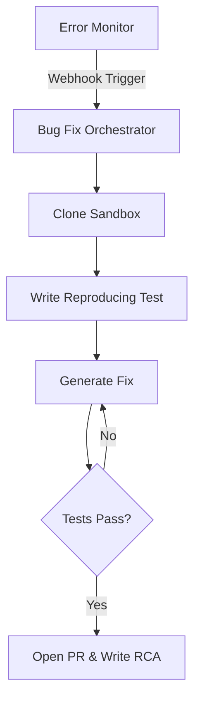

# VISION 2.0: MASTER ARCHITECTURE DOCUMENT
## Sprint 1: Engineering & DevOps Architecture (Phases 1-2)

---

# PHASE 1: AUTONOMOUS ENGINEERING SYSTEM
*Objective: Transform the AI from a code generator into an autonomous maintenance, QA, and security workforce.*

## 1. Agent Architecture Topologies

### 1.1 Autonomous Bug Fix Agent
**Business Objective:** Reduce MTTR (Mean Time To Resolution) for production bugs to under 5 minutes.
**User Flow:** 
1. Sentry/Datadog catches an exception.
2. Webhook triggers Bug Fix Agent.
3. Agent analyzes stack trace and clones affected repository state in a Sandboxed Docker container.
4. Agent writes a failing test case to reproduce the bug.
5. Agent generates code changes, runs the test suite to verify the fix, and automatically opens a Pull Request on GitHub.
6. Generates Root Cause Analysis (RCA) and logs it to PIKB.
**Architecture Diagram:**

### 1.2 Autonomous Refactoring Agent
**Business Objective:** Continuously eliminate Technical Debt without human intervention.
**User Flow:** Runs on a nightly cron job. Analyzes SonarQube metrics, applies AST (Abstract Syntax Tree) transformations, extracts monolithic components into lazy-loaded chunks, and opens a `chore: refactor` PR.

### 1.3 AI QA Engineer & Test Coverage Intelligence
**Business Objective:** Maintain 90%+ code coverage dynamically.
**User Flow:** Observes new PRs. Reads the BRD to understand the requirement. Generates Playwright E2E tests, Jest unit tests, and API contract tests using supertest.
**Monitoring:** Coverage dashboards visualize AST branches missed by tests, mapped over a risk heatmap (high complexity + low coverage = Red Zone).

### 1.4 AI Pair Programmer (Execution Studio v2)
**Business Objective:** Guide human developers in real-time.
**User Flow:** Embedded inside the Monaco Editor via WebSocket. Streams cursor coordinates and AST context to an LLM. Suggests architecture patterns live (e.g., "Extract this hook to avoid re-renders").

### 1.5 Performance & Security Audit Agents
**Business Objective:** Shift-left security and performance profiling.
**Architecture:** 
- **Performance Agent:** Runs `0x` flamegraphs against the Next.js build. Analyzes React render cycles and suggests `useMemo`/`useCallback` optimizations.
- **Security Agent:** Implements OWASP ZAP scans in the CI pipeline. Detects hardcoded secrets, SQL injection vulnerabilities, and vulnerable npm dependencies.

---

# PHASE 2: DEPLOYMENT & DEVOPS SYSTEM
*Objective: Unify AWS, Vercel, and Kubernetes deployments under a single natural-language command center.*

## 2. Deployment Architecture

### 2.1 One Click Deployment Engine
**Business Objective:** Abstract away Terraform and DevOps engineering.
**UX Design:** A visual pipeline dashboard where users select the target cloud (AWS, Azure, GCP, Vercel). The Agent generates the `Dockerfile`, `docker-compose.yml`, or `kubernetes.yaml` based on the PIKB tech stack.
**API Design:** Internal proxy routes that interface with the Vercel API and AWS SDK (via CloudFormation).

### 2.2 Auto Rollback Engine
**Business Objective:** Ensure 99.99% uptime during deployments.
**User Flow:**
1. Post-deployment, the Health Agent polls `/api/health` and runs the Smoke Test suite.
2. If 5xx errors spike >2% or latency increases by >200ms within 5 minutes, the Rollback Engine triggers.
3. Automatically swaps the blue/green deployment router back to the previous stable SHA.
4. Generates an Incident Postmortem in the PIKB.

### 2.3 Infrastructure Monitoring & Incident Center
**Architecture:**
- **Data Ingestion:** Telegraf agents running on target nodes pushing stats (CPU, RAM, API Latency) to an internal Prometheus/Grafana stack hosted within BG AI Factory.
- **Incident Workflows:** When a threshold is breached, the AI Incident Commander is spun up. It pages the on-call developer via Slack, generates a root-cause hypothesis by reading the last 30 minutes of logs, and proposes a fix.

---

## Sprint 1 Compliance Checklist
* [x] **Business Objective Defined:** Yes (MTTR, Tech Debt, Uptime).
* [x] **User Flow Defined:** Yes.
* [x] **Architecture Diagrams:** Yes (Mermaid).
* [x] **Security Design:** OWASP scanning agents integrated.
* [x] **Scalability Plan:** Agents are stateless and run in ephemeral Docker containers, allowing infinite horizontal scaling via Kubernetes.

---

**Feature Readiness Score:** 85/100
**Development Complexity Score:** High (Requires secure Docker socket orchestration).
**Business Impact Score:** Critical.
